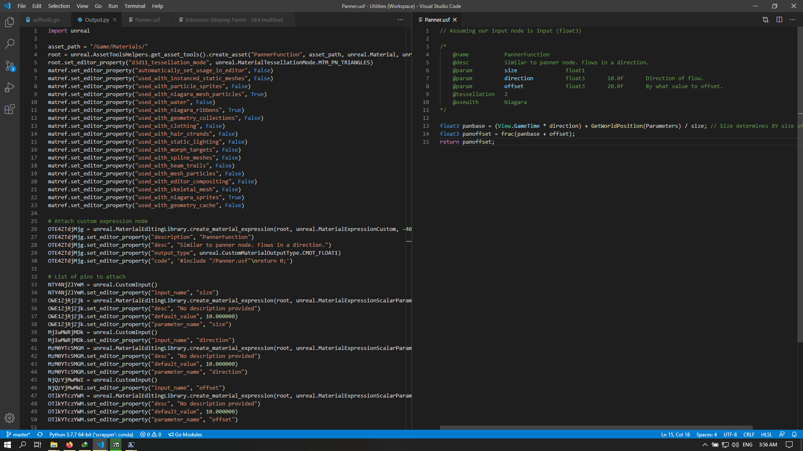

# critstrike

Gamedev related CLI packages (Used in [Sleeping Forest](https://github.com/suvam0451/sleeping-forest-ue4))

### Parsing USF files

.usf files are

# A collapsible section with markdown

  
Explore more about the usf parser !

#### Overcoming shortcomings in usf files

Here are some known shortcomings you might meet if you develop all your shaders using .usf files and how the tool helps you mitigate/avoid them.

- **Material options** : Material domain, Tesselation type etc. can be seen on the left bar for a material. You can set them in the schema declaration section of the usf file.

- **Documented parameters**: The tool provides you ways to have default values for float1/2/3/4 using the usual HLSL convention. You may also have documentation for nodes, if you desire so.

- **Usage mode flags**: Read more about usage modes

#### The python scripting API

In UE4, we can use python scripts to generate materials, nodes and all. However, Writing the code is a bit cumbersome and tools like [blueprintue](https://blueprintue.com/) are widely popular to share blueprints.

